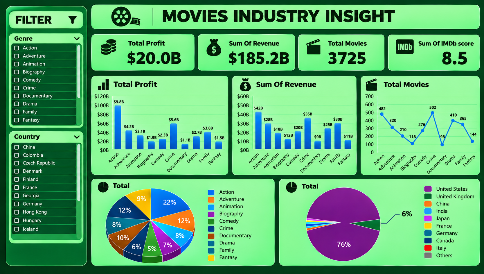

# Movies Industry Insight Dashboard

An interactive Excel dashboard analyzing profit, revenue, genre performance, and country distribution across 3,725 movies. Built as a single-page visual summary translating raw movie-industry data into actionable business insights.

## 🔗 Overview

| | |
|---|---|
| **Tool** | Microsoft Excel (Pivot Tables, Pivot Charts, Slicers) |
| **Data** | Movie industry dataset — Genre, Country, Revenue, Profit, IMDb Score |
| **Scope** | 3,725 movies, 10 genres, 16+ countries |

## 🎯 Objectives

- Deliver a single-page visual summary translating raw movie rows into top-line KPIs
- Compare profit and revenue performance across genres
- Track how many movies were produced per genre
- Surface which countries dominate global movie production

## 📊 Dashboard Components

- **KPI Header Row** — Total Profit, Sum of Revenue, Total Movies, Average IMDb Score (8.5)
- **Total Profit by Genre** — ranked column chart across 10 genres
- **Sum of Revenue by Genre** — ranked column chart across 10 genres
- **Total Movies by Genre** — line chart showing movie count distribution
- **Genre Share (Pie)** — percentage breakdown of movies by genre
- **Country Share (Pie)** — percentage breakdown of movies by production country, with a "6% / 76%" callout highlighting US dominance
- **Genre and Country Slicers** — interactive filters allowing the dashboard to update dynamically

## 🛠️ Process & Problem-Solving

This project went through a full formatting and readability pass after an initial draft:

- **Illegible axis labels** — genre and country names on the original charts overlapped and were unreadable at normal zoom. Fixed by enlarging each chart individually and increasing axis/label font size.
- **Uninformative chart titles** — every chart was originally labeled "Total," giving no indication of what was being measured. Renamed each to describe its actual content (e.g. "Total Profit," "Sum Of Revenue," "Total Movies").
- **Low-contrast background** — the dashboard's white background clashed with the dark theme intended for the visuals. Removed the white sheet background and applied a consistent dark green theme throughout.
- **Overcrowded country pie chart** — the country distribution pie originally listed dozens of countries with mostly invisible slices. Simplified the legend and added a direct percentage callout (76% United States, 6% United Kingdom) to make the skew immediately legible instead of relying on illegible tiny slices.
- **Misleading IMDb metric** — the original KPI summed IMDb scores across thousands of movies, producing a number with no real-world meaning. Fixed by changing the pivot field summary from Sum to Average, now displaying a clear, interpretable average rating (8.5) instead.

## 💡 Key Insight

The United States dominates global movie production at **76%** of the dataset, with the United Kingdom a distant second at **6%** — highlighting how concentrated movie production is by country, despite genre performance (profit and revenue) being far more evenly distributed across categories like Action, Crime, and Family.

## 📈 Results

- Top-line KPIs: **$20.0B Total Profit**, **$185.2B Total Revenue**, **3,725 Movies**
- **Action** is the top-performing genre by both profit ($9.8B) and revenue ($42B)
- **Crime** and **Family** are strong secondary performers across both metrics
- Movie count fluctuates significantly by genre, with **Crime (502)** and **Action (482)** leading production volume

## 🧰 Skills Demonstrated

- Excel dashboard design (Pivot Tables, Pivot Charts, Slicers)
- Iterative design critique and revision (fixing readability, contrast, and labeling issues)
- Translating raw counts into a clear percentage-based narrative
- Visual hierarchy and dashboard layout for non-technical audiences

## 📁 Repo Contents

- `B3.xlsx` — the Excel file
- `dashboard-preview1.png` — screenshot of the finished dashboard
- `README.md` — this file

## 👤 Author

Ajayi Oluwatimilehin Benjamin
[LinkedIn](https://linkedin.com/in/benaj619) · [Portfolio](https://benaj619.my.canva.site) · benaj619@gmail.com
